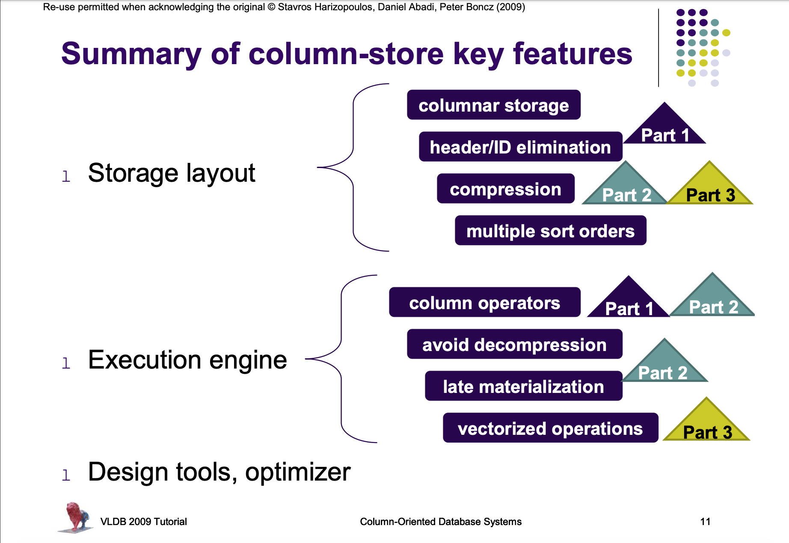

# Column-Stores

* Column-store systems completely vertically partition a DB into a collection of individual columns that are stored separately.
* If a single record needs to be fetched, column stores need multiple seeks, whereas a row store can do it in a single seek. If there are many records to be accessed, the seek time gets amortized over records. As more and more records are accessed, transfer time begins to dominate seek time and column stores begin to perform better than row stores. Hence columns stores are typically used in analytic applications, with queries that scan a large fraction of individual tables and compute aggregates or statistics over them.

## Specific Ideas

1. Virtual IDs: Explicitly representing a key with each value stored in the column bloats the size of the data on disk, and makes I/O less efficient. Instead, we could use the offset of the tuple in the column as a virtual identifier. Attributes can be stored as fixed-width dense arrays, and each record can be stored at the same array position across columns. This makes it very simple to access a record based on its offset. The *i*-th value in column *A* resides at the location *startOf(A) + i\*width(A)*. Another major advantage of column stores is improved compression ratio. Now it is entirely possible that a good compression algorithm compresses data in a non-fixed-length way, such that data cannot be stored in an array. This makes it a trade-off between simplified sequential access and greater compression.
2. Block-oriented and vectorized processing: In row-stores, multiple function calls are made to process a tuple at a time. In column stores, since we process a single column at a time, we make a single call to the column. Values are chunked into vectors. These vectors are processed one at a time, making use of bitwise operation and SIMD hardware support.
3. Late materialization: Tuples reconstruction is delayed, allowing CPU to run tight for loops over a single column. Results in CPU and cache-friendly patterns.
4. Column-specific compression: The same attribute is stored together, hence specific simple compression schemes can be used to achieve good compression ratios.
5. Direct operation on compressed data: By delaying decompression until it is absolutely necessary, column stores greatly improve utilization of memory bandwidth as the columns are compressed in memory as opposed to wider decompressed tuples.
6. Efficient join implementations: 
7. Redundant representations of individual columns in different sort orders: storing columns based on attributes that are heavily used in the workload can result in substantial performance gains. Moreover, sorted columns can be aggresively compressed.
8. Database cracking and adaptive indexing: Each query partially reorganizes the columns it touches to allow future queries to access data faster. Fixed-width columns allow for efficient physical reorganization, while vector processing means whole blocks of columns can be efficiently reorganized in one go. [More on database cracking](cracking.md)
9. Efficient loading architectures: Column stores may be slower to load and update data because each column is written separately and data has to be compressed. Since this is a significant concern in data warehouse systems, optimized loaders are important. For example, C-store first writes data into an uncompressed, write-optimzed buffer (WOS) and then flushes large, compressed batches of it periodically.

[Source: Stanford CS-346, 2015](https://web.stanford.edu/class/cs346/2015/notes/old/column.pdf)

## Column Store Internals

### Vectorized Processing

* Two prominent strategies for the query execution layer - volcano style tuple-at-a-time-processing, and full materialization.
* In the volcano model, the `next()` method of each relational operator in the query tree produces one new tuple at a time, obtaining input data by calling the `next()` method on its child operators in the tree.
* This minimizes the materialization of intermediate results, but results in a large number of function calls, and pulls in complete tuples even though they might not be required.
* In full materialization, each query operator works in isolation, consuming from storage and writing to storage.
* This minimizes the number of function calls, and allows execution in very tight for loops, but results in large intermediate results.
* Example: `select avg(A) from R where A < 100`. In the FM model, the select operator scans the complete column A, materialzes the intermediate results, and then the aggregation operator computes the aggregate. In the volcano model, on the other hand, the select operator pushes qualifying tuples, one at a time, to the aggregation operator.
* Some column-oriented data stores try to exploit the intermediate results by caching them and treating them as miniature DBs.
* Vectorized execution attempts to strike a balance between the two earlier approaches. In the vectorized approach, control flow is the same as in the volcano model, except that the `next()` method of each operator returns a vector of N tuples as opposed to only a single tuple. At the data processing level, the primitive operators mimic the block model, processing vector at a time instead of tuple at a time. Thus, vectorization combines pipelining with the array-loops pattern.
* The typical size of the vectors is such that each vector fits in L1 cache. Modern column stores work with one vector of one column at a time. This means the L1 cache has to fit only one vector, its possible output and auziliary data structures. 
* Vectorization reduces interpretation overhead (function calls performed by query interpreter)
* It offers better cache locality.
* There are opportunities for compiler optimization. For example, the tight loops over arrays typically trigger compilers to generate SIMD isntructions.
* Tuple-at-a-time execution has to check for local conditions at every tuple (ex. output buffer overflow). Vectorized execution needs only check once per vector.
* Tight vectorized loops on modern CPUs generate multiple outstanding cache misses, for different values in a vector. This is because when a cache miss occurs, modern CPUs can speculate ahead in such loops. The alte binding API calls which the CPU encounters between processing different tuples in the tuple-at-a-time architecture inhibits this pattern.
* The overheads of profiling performance metrics for a vector is amortized over all the tuples in the vector. Strong profiling also enables on-the-fly-decisions about splitting tuples into vectors.

### Compression
