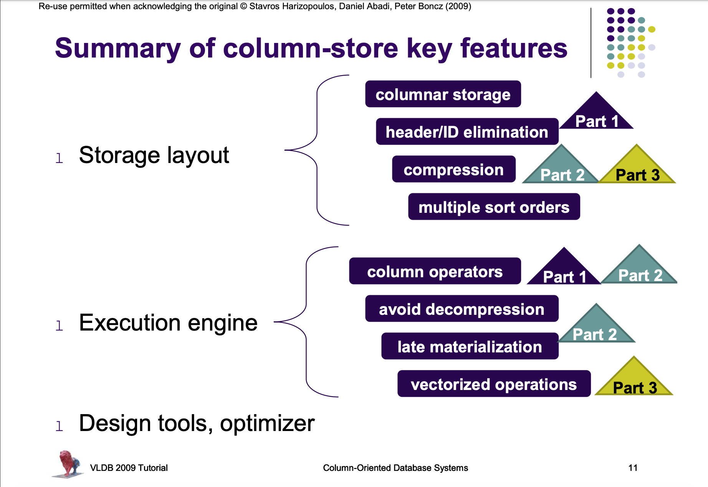
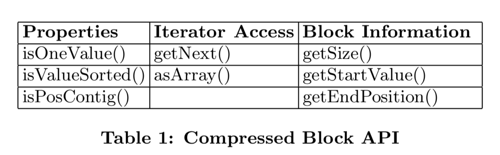
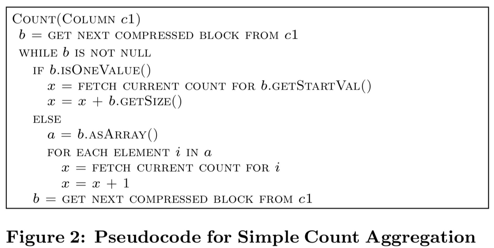
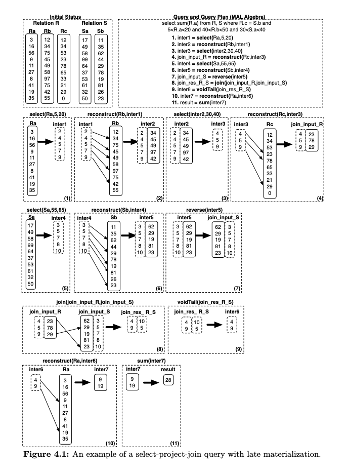

# Section 3

***

Column-oriented stores, MonetDB, C-Store, Vector-Wise, database cracking

***

## Column Store Implementations

### C-Store:
   - Data represented on disk as column files
   - ROS and WOS: ROS has compressed, sorted columns; WOS has uncompressed, not partitioned data; a process moves data between ROS and WOS periodically
   - Compression methods can be different for each column and depend on data type, whether the column is sorted and number of distinc values
   - Projections: groups of columns sorted according to some attribute; different sort orders can be maintained to optimize certain frequent queries.
   - C-Store has sparse indices: leverage sorting for efficient indexing
   - No overwrite storage: maintain a delete column.
   - Vertica is implemented as a shared nothing massively parallel distributed database

### MonetDB and VectorWise:
   * MonetDB:
      - Column at a time algebra: BAT Algebra; operators consume and produce BATs. Contrast with tuple at a time, pull based, iterator approach
      - Late materialization allows a front-end/back-end architecture, all processing is done on BATs by translating user queries to BAT algebra in front-end.
      - Why is BAT algebra faster? Hard coded semantics, predicate-less operators, therefore no expression interpreter needed. Complex expressions still have to be mapped to a sequence of BAT algebra operations but this is done at a higher granularity than tuple based RDBMS expression interpreter. (the RISC approach to db query languages)
      - Runtime query optimization, compiling code on the fly
      - Explicit additional table and operators for transaction management, so that read-only queries avoid that overhead; update columns are maintained for each base column
   * VectorWise:
      - Vecrorised execution model, solves the problem of full materialization of intermediate results in MonetDB
      - Has buffer management, hence I/O is managed

### Other Implementations:

   * Two main architectures:
      - Columnar storage only
      - Native column-store designs

   * IBM BLU/BLINK:
      - Frequency partitioning

   * MS SQL Server:
      - Column indexes for enhancing scans or as a primary storage choice

## Column Store Internals

[Source: Stanford CS-346, 2015](https://web.stanford.edu/class/cs346/2015/notes/old/column.pdf)

## Column Store Internals

### Vectorized Processing

* Two prominent strategies for the query execution layer - volcano style tuple-at-a-time-processing, and full materialization.
* In the volcano model, the `next()` method of each relational operator in the query tree produces one new tuple at a time, obtaining input data by calling the `next()` method on its child operators in the tree.
* This minimizes the materialization of intermediate results, but results in a large number of function calls, and pulls in complete tuples even though they might not be required.
* In full materialization, each query operator works in isolation, consuming from storage and writing to storage.
* This minimizes the number of function calls, and allows execution in very tight for loops, but results in large intermediate results.
* Example: `select avg(A) from R where A < 100`. In the FM model, the select operator scans the complete column A, materialzes the intermediate results, and then the aggregation operator computes the aggregate. In the volcano model, on the other hand, the select operator pushes qualifying tuples, one at a time, to the aggregation operator.
* Some column-oriented data stores try to exploit the intermediate results by caching them and treating them as miniature DBs.
* Vectorized execution attempts to strike a balance between the two earlier approaches. In the vectorized approach, control flow is the same as in the volcano model, except that the `next()` method of each operator returns a vector of N tuples as opposed to only a single tuple. At the data processing level, the primitive operators mimic the block model, processing vector at a time instead of tuple at a time. Thus, vectorization combines pipelining with the array-loops pattern.
* The typical size of the vectors is such that each vector fits in L1 cache. Modern column stores work with one vector of one column at a time. This means the L1 cache has to fit only one vector, its possible output and auziliary data structures.
* Vectorization reduces interpretation overhead (function calls performed by query interpreter), and offers better cache locality.
* There are opportunities for compiler optimization. For example, the tight loops over arrays typically trigger compilers to generate SIMD isntructions.
* Tuple-at-a-time execution has to check for local conditions at every tuple (ex. output buffer overflow). Vectorized execution needs only check once per vector.
* Tight vectorized loops on modern CPUs generate multiple outstanding cache misses, for different values in a vector. This is because when a cache miss occurs, modern CPUs can speculate ahead in such loops. The late binding API calls which the CPU encounters between processing different tuples in the tuple-at-a-time architecture inhibits this pattern.
* The overheads of profiling performance metrics for a vector is amortized over all the tuples in the vector. Strong profiling also enables on-the-fly-decisions about splitting tuples into vectors.

### Compression

* Compressing column-at-a-time is good, compressing projections of columns is much better.
* CPU speed has increased, memory access speed has not. We have spare cycles to decompress data. Moreover, we bring in smaller amounts of data. (CPU expends less time fetching from memory)
* Use simpler ("lighter") compression schemes that compress data less effectively into fixed-length records than complex ("heavier") schemes that pack data effectively but sacrifice the fixed length of the compressed records. This enables one to leverage the SIMD instructions of the CPU.
* Frequency partitioning - organize each column based on the frequency of values that appear in the column, ie. frequent values are stored together in the same page(s). Per page dictionaries become much more compact. For ex. a page having only two distinct values needs a single-bit dictionary.
* Compression algorithms include:
   - Run-length Encoding (replaces arbitrary blocks of values, not fixed length)
   - Bit-Vector Encoding
   - Dictionary (requires fast hashing - cuckoo hashing)
   - Frame of Reference (can be combined with delta coding)
   - Patching Technique
* Operations can be performed on uncompressed data. For example addition becomes multiplication if data is compressed using RLE. However, the DB kernel must be aware of how data is compressed. This can make the kernel code non-extensible by causing a long if-else ladder. Components called *compression blocks* are used to provide a set of standard APIs to the query executor. The operator can call, for example, the `getSize()` method of the compression block to get the number of compressed records. Therefore, every time a new compression scheme is to be added, it must expose an appropriate interface. But no changes are required to be made in the query operators. The interface must consist of the following:
   - Code that compresses data
   - Code that breaks up compressed data into compression blocks during a scan of compressed data from storage
   - Code that iterates through compression block and optionally decompresses dta during the scan.
   - Values for all relevant properties to be exposed
   - Code that derives high level information (metadata specific to algo)

### Late Materialization

* Recent column-stores keep data in the columns until much later in the query plan, and instead operate directly on the columns. Tuple reconstruction has to be performed at least `N-1` times where `N` is the number of attributes referenced. Projections make tuple reconstruction easier.
[Source: Abadi et al. Column Stores](http://www.cs.umd.edu/~abadi/papers/abadi-column-stores.pdf)
* Advantages of LM:
   - Avoid materialization of tuples rendered unnecessary by selection and aggregation.
   - Avoid unnecessary decompression
   - Cache performance is improved by populating it with "pure" columnar data
   - Vectorization benefits can be obtained with fixed length records
* Multi-column blocks or vector blocks can be used as the storage construct. This structure is cache-resident. This allows pipelining of predicate evaluation output directly to the intersection operator, enabling construction to occur while the values to be stitched together are present in cache.

## Database Cracking

***

[Video of the talk](https://www.youtube.com/watch?v=FQORtJtqovY)

***

### Refresher on indexing

[Database indexing](indexing.md)

### Problem statement

* Current implementations first load data, then experts (people with domain knowledge and DB knowledge) tune the DB by creating indexes, and then the DB is ready for querying. Data --> Query time is very high.
* The workload (data + queries) is not always stable. An index is created with a workload profile in mind. You spend resources to create and maintain indices. One problem in CS is that we build a data structure assuming we know our exact need and its exact use, and expend time and resources building said structure.
* All inner indices are stored on disk. So assuming a 2-level index, the secondary index has to make multiple disk accesses to fetch records from the primary index. Secondary indices are already dense and unsorted. This means a ton of disk accesses.
* Thus indexing needs to be optimal ALWAYS, and not just at the start of querying time.

### Cracking

* We do on-the-fly physical reorganization of data in-memory with every query
* The data that satisfies the predicate, ie. only the data we touch is physically reorganized. For example, if we need all values between 5 and 10, we physically sort the column so that it is broken into three pieces, less than 5, between 5 and 10, and greater than 10.
* As we keep on doing this, the number of values to be sorted tends to become smaller, and at any time, we have to touch at most two pieces. (In the extreme case, each piece is own value - terrible, but then there are checks in place to avoid mindless cracking)
* Now these changes need to be propagated to the other columns as well. The key idea is that I/O must always be performed in a sequential manner.
* Propagation is done in a lazy manner. If there is a query on A-B, B is re-organized. If there's a query on A-C, C is re-organized, and so on. There's always a leading column that has the latest re-organization. This is referred to as sideways cracking: cracking that is propagated sideways.
