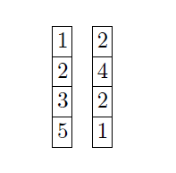
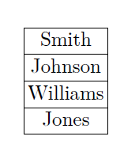
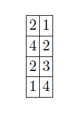
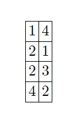
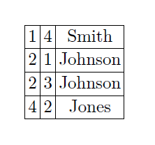
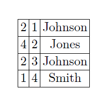

# Column-Oriented Database Systems

___

## A Note on Jive Join

Jive stands for *Join Index with Voluminous relation Extensions*. The Jive join algorithm uses a supporting data structure, called a "Join Index" to speed up join queries and provide better performance than even the fastest *ad-hoc* join algorithms (like Hybrid Hash-Join). A join index is simply a set of pairs of tuple-ids (t_1, t_2) such that t_1 is a tuple-id (a positional index, for example) of a tuple in R_1 that matches the tuple with id t_2 in R_2. Join index can be calculated in a single pass of relations R_1 and R_2.

For many join algorithms, the positions of the left (outer) input relation maintain their sorted order in the output (join index in this case), whereas positions of the right (inner) input relation don't. Retreiving other columns from the unorderd output is problematic because it would require a linear scan for every tuple, which would result in a lot of "jumps" in the storage, increasing the seek time overhead. In Jive join, an additional column of densely increasing sequence of integers is added to the unordered output column. This *modified output* is then sorted by the original list of positions and then a scan is performed to get the values of other columns. Since the list of positions is now ordered, the scan is sequential rather than random. Values of the new column are added to the modified output and it is sorted again, this time by the extra column that was added to the orginal output, to restore the original join order.

This algorithm allows all columns to be iterated through sequentially, at the cost of adding two sorts of the join output data. The cost of these additional sorts increases with the size of the join output (i.e., the number of tuples that join). Since most database systems have a fast external sort algorithm implemented (that accesses the input as sequentially as possible), this algorithm can cause significant performance improvements relative to the random access that would result from the more naive implementation of a late materialized join.

An example:

join index is:

Note here that the inner input relation tuple-ids are unordered.

Let's say we want the *customer name* column of the inner relation in the output:

The *modified output* and sorted *modified output* looks like:

And the final output before and after re-sorting is:

