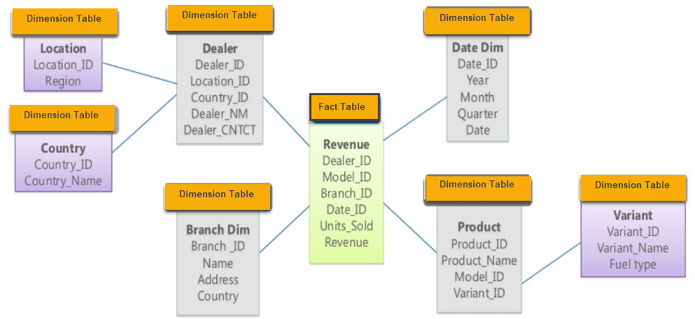
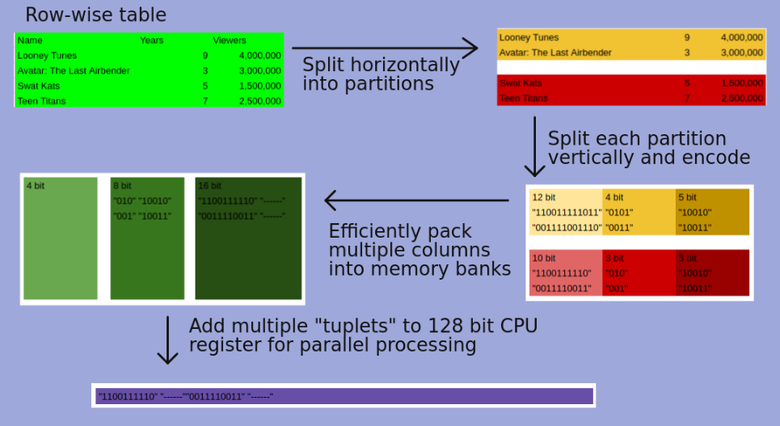

Blink is a main memory DBMS, that is aimed at solving read-mostly BI queries by exploiting scale out of commodity multi-core processors.

BI queries usually work on giant data marts that have a "star" or "snowflake" shaped schema. The dimension tables contain all the information about a single logical entity while the fact table aggregate the primary keys of these fact tables. There can be hybrid tables as well that aggregate keys and also contain data fields.

Traditional DBMS's rely upon performance of indexes or materialized views to speed up queries. However the ad hoc nature of BI queries is an anathema to this approach. Blink does away with indexes, views or anything related to a performance layer. Instead it uses,

1. Excellent encoding and compression techniques
2. Cache conscious algorithms to minimize memory bandwidth
3. SIMD operations of vectors of compressed data

> Compression and Storage

Columns is compressed by encoding values with a fixed-length order-preserving dictionary code. Compression uses frequency partitioning to horizontally `partition` each column. Since each dictionary needs only to represent the values of its partition each dictionary can use shorter column codes. Also encoded values are assigned in each dictionary in an order preserving way, so that range and equality predicates can be applied directly to encoded values.

Blink asserts that both row major and column major stores are sub optimal -

* Row major because queries have to scan unreferenced columns.
* Column major because encoded columns must be padded to work boundaries for efficient access.

Blink solves the padding issues by maintaining fixed-width `memory banks` of 8,16, 32 and 64 bits each to allow efficient ALU operations. The encoded columns are vertically partitioned and grouped by a bin packing algorithm into different banks in a way that minimizes padding. This way the tuplet of each bank contains the encoded values of one row for the columns (it's possible that only one column is assigned) assigned to that bank.

This layout exploits SIMD instructions that allows a single operations on as many `tuplets` that can be packed into a 128-bit register of the CPU. Note this 128-bit is different from the bit-widths mentioned above as they are talking about storage.

This feels like a hybrid row and column storage. It is divided row first and then stored as grouped columns. However the bin packing algorithm only considers padding it does not consider which columns maybe accessed together.

> Overview of Query processing

Query processing is very simple because there is no optimizer to choose access paths or plans. But it is also more complex because the query must be compiled for different column widths. However the operations themselves are simple, Blink can only access tables in one way scan them and always performs joins and grouping using hash tables in a pre-specified order.

Each SQL query is broken up into Single Table Queries (STQ). Each STQ scans a dimension table and builds a hash table of the columns that survive any local predicates. For hybrid tables the query probes dimension tables relative to it and then builds a hash table for the subsequent join to the fact table relative to it (this sounds a lot like tree traversal, where dimension tables are leaf nodes). Compilation has to be done separately for each partition, this has an added advantage that an entire partition maybe eliminated if it's dictionary does not contain any matching values.

This process of evaluating which partitions do not contain any relevant values to the query is part of the `value space to code space conversion`. These partitions are not considered in the solution. Even the partitions that are considered, their dictionaries no longer need to be consulted as the query runs on all the values in the partition. Finally for the partitions that are considered, Blink converts the queries to suit the widths of these partitions. This completes the conversion.

The query processing for partitions is divided between threads on cores. Threads that complete their work can steal partitions from other threads and hence balance the load automatically. For each partition a three stage process is followed,

1. fastpath predicate evaluation like conjunction/disjunction with range and short IN-list selection predicates. Since values are encoded in order, predicates containing arbitrary conjunctions can be evaluated using register-wide masks and compare instructions.
2. residual predicates link joins and general purpose expression interpreter.
3. grouping and aggregation: each thread maintains its own hash table for grouping and aggregation.

Blink processes a large gulp of rows, called a `stride`, at each stage, this exploits Instruction Level Parallelism (ILP) and SIMD.

___

> Products using Blink

Blink works as a query accelerator that is "plugged" onto existing solutions. Once a user chooses a data mart for acceleration the data/tables are pre processed to Blink's requirements and partitions are stored on different nodes. The allocation to different nodes is node controllable by the user. An SQL query is first parsed and error checked and then it is sent to the Blink accelerator. The user does not need to change anything. If the query contains any data that has been loaded in Blink it is accelerated.

Examples are,
1. IBM Smart Analytics Optimizer (ISAO)
2. Informix Warehouse Accelerators (IWA) - which has shown speed up of 60x-1400x

___

> Next Generation Blink

1. Relax the requirement that all data must be in main memory. This opens up a host of issues related to disk I/O that need to be solved.
2. However a persistent storage means that Blink can now own the data removing the need for keeping multiple copies in sync. However, it creates performance issues for point queries i.e. queries where entire disk has to be scanned to by find one tuple. Refer to [link](https://www.percona.com/blog/2008/01/18/the-trouble-with-point-queries/)
3. Rethinking algorithms and data structures for joins and groups to minimize cache misses while avoiding locks and latches.
4. Adding disks opens up the possibility of using interrupts to disk I/O to switch context between multiple concurrent queries.

