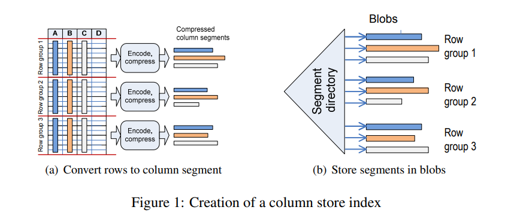

# 3. Columnar Storage in SQL Server 2012

## 3.1 Introduction

* SQL Server used to support pure row storage with two kinds of organization for indices - heaps (unordered) and B-trees (ordered). The primary index could be either, whereas secondary indices were always B-trees. Filtered indices were also supported, ie. an index to store rows that satisfy a particular predicate.
* SQL Server 2012 introduces columnar storage and batch-at-a-time processing.
* It exposes columnar storage in the form of a new index type - column store index.
* Queries are submitted as earlier and the query optimizer decides which index to use, as usual.
* What separates it from Actian Vectorwise is that it allows a query to access data from both kinds of indices.

## 3.2 Column-wise index storage

* The above figure illustrates how a new column store index is created.
* The rows are first grouped together into groups of about a million rows each. Each group is then encoded and compressed independently, producing one compressed column segment for each column included in the index.
* The column segments are then stored using existing storage mechanisms, with each column segment being stored as a separate blob. Different columns are stored on different pages, but a single blob might end up spanning multiple pages. This is handled by the existing blob storage mechanisms. A segment directory keeps track of different column segments. This directory also maintains metadata about the segments (min, max, size, encoding, etc).
* Dictionary compression is used for string columns, and the resulting dictionaries are stored in separate blobs.
* Using blob storage leverages existing storage mechanisms, and also features like logging, locking, recovery, partitioning, mirroring, replication, and so on.

## 3.3 I/O and Caching

* Column segments and dictionaries are brought into memory as needed. They are not stored in the paginated buffer pools, but in a new cache designed to hold large objects. Each object is stored contiguously and not scattered across pages.
* A column segment might span multiple disk pages. Therefore, read-ahead is aggressively applied at the page and segment levels, and for data dictionaries.

## 3.4 Batch Processing

* Standard operators process data based on a row-at-a-time iterator model. Batch processing introduces operators that process batches of rows at a time.
* A batch typically consists of around a thousand rows. Each column is stored as a contiguous vector of fixed-size elements.
* A separate *qualifying rows* vector is maintained alongside the column vectors. Values of this vector signify whether a row has been logically "deleted" from the batch. When predicates are evaluated, results are marked by setting/resetting (a single) bit in the qualifying rows vector.
* Row batches can be processed very efficiently. On modern hardware, it enables loop unrolling and memory prefetching and minimizes cache misses, TLB misses and branch mispredictions.
* Only a subset of the query operators are supported in batch mode: scan, filter, project, hash (inner) join and (local) hash aggregation.
