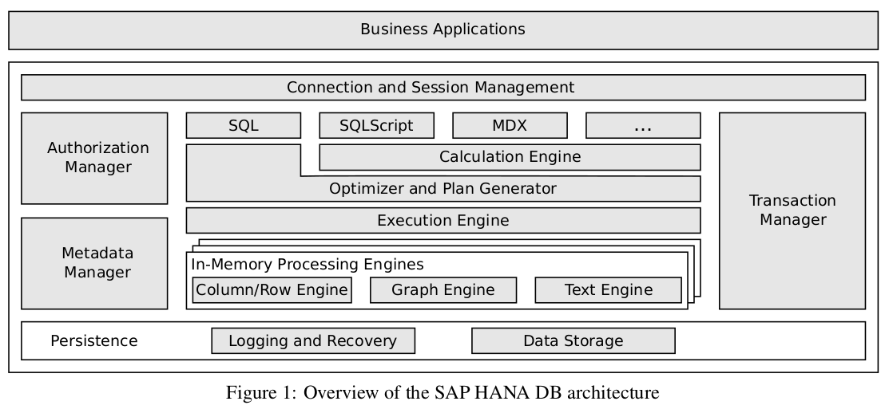

SAP Hana does a balancing act of doing everything efficiently while also being modular and supporting as many types of user queries as possible. The epitome of enterprise software.

Row-oriented dbs perform well with OLTP, for e.g frequent writes and udpates about sales data. While complex queries like aggregating sales data are better suited to OLAP type database which work best with column storage.

SAP Hana derives from historical dbs. SAP Trex and SAP BI Accelerator for fast OLAP processing and P* Time for OLTP type workloads. It derives logging, recovery and durable storage from SAP MaxDB.

___

Hana SQL queries as well as more expressive interaction models. Relational data resides in the combined column and row engine and can be converted from one layout to another to allow query expressions with tables in both layouts. Hana is designed to be extensible where different engines can be plugged in to process more expressive query languages.

It aims to to be a main memory centric data management system. One of it's main features is that data structures are optimized for cache-efficiency rather than disk storage. While data is stored in memory, it is also stored by the persistence layer to persistence layer for recovery and backup.

To support and optimize many query languages, Hana converts queries to a more expressive abstract data flow model. Following this route multiple domain-specific languages can be supported as long as compiler can generate intermediate calculation model representation.

A calculation model constitutes a logical execution plan consisting of an acyclic data flow graph with nodes representing operators (plan operations) and edges reflecting the data flow (plan data). To be expressive, Hana needs and does support a huge variety of special operators for implementing application-specific components in the database kernel. Most of these operators speed up OLAP by exploiting columnar data layout. The special operators allow Hana to model specific domains like,

1. Statistical algorithms (linear, non-linear, time-series etc)
2. Planning (path, scheduling etc.)
3. Other special operators

The plan is derived from the logical data flow description provided by the cost model. Independent paths in the data flow can be executed parallely.

Columnar encoding is very similar to other techniques we've studies before including efficient compression, sorted dictionary, RLE and similar benefits related to SIMD, parallel execution.

___

> OLAP

OLAP takes full advantage of column storage. What is more interesting is how it handles drawbacks. Single updates to column store (compressed and encoded) can be very expensive so they are maintained in separate delta storage, which is designed to balance high update rates and good read performance. *To minimize tables lock time when delta is merged, write operations are redirected to a new delta storage and read operations read from both old and new delta stores.*

___

> OLTP

Why column stores are used in OLTP workloads -

1. Many columns can be heavily compressed this gives them an advantage with OLTP by reducing memory consumption
2. Real world transactional workloads have a larger portion of read operations than standard benchmarks
3. Column store "append-only" style is simpler and more efficient than in place updates or rows
4. Reduce the need for indices reducing memory consumption

___

> Challenges

1. Column storage can result in more fine grained data access pattern. Allocating memory for each column can be wasteful. Hana solves this by allocating for multiple columns into a single one whenever it helps performance. This sounds a lot like the technique described in db architecture overview paper about having high level primitives to control blocks of memory at application level.

2. Frequent single record updates adds lot of entities to delta storage, which results in frequent merges from delta to main storage which is CPU and memory intensive. Hana solves this problem by careful scheduling and parallelization.

> Curious cat

1. What kind of special operators does Hana support? Any examples?
2. How is data converted between row and column layout as required?
3. What are the cons of having a db try to be good at everything?

