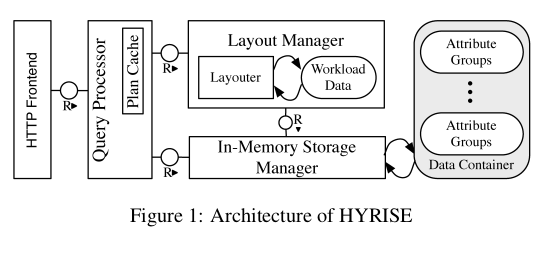
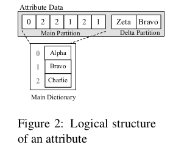

HYRISE argues that narrow columns are good for OLAP type queries as done in pure columnar systems, while OLTP type queries work better on wider partitions, to reduce cache misses when performing single row retrievals. The two types of queries have been handled separately very well, however with increasing demand for real-time analytics there is need for a database that can do both. Here HYRISE shines because it partitions tables to varying widths depending on how the columns are accessed. It achieves this through the 3 main components namely,

* a hybrid storage engine
* a hybrid layout manager
* a query engine

The creators of the database felt the main memory systems are a better choice for such a system. Moreover they felt that main-memory is future proof because it will continue to be possible to store queried data in main memory.



___

### Hybrid Storage Engine

HYRISE tries to vertically partition relation tables into disjoint sets of attributes. Each partition is internally represented as a **container**. Containers can be composed together.

A container stores tuples inside a single compressed block of main memory. Additionally it uses dictionary compression to replace actual values with an encoded value id. The dictionaries are stored as sorted lists allowing offset-based mapping from encoded value to actual values. There are advantages to this storage are:

1. Effect of each access to a container can be calculated independently of the actual value or value distribution.
2. Expensive value based comparison e.g. on string values, can be executed in the dictionary directly using efficient binary operations on integers.
3. Due to explicit ordering of value ids, it only needs materializes intermediate results as values when it is explicitly required to do so during query execution (Till materialization query can work with position values).

Modifications are stored in an uncompressed delta partition. To optimize memory consumption and query performance it is "cyclically" re-compressed. The logical structure of an attribute is therefore stored in the compressed dictionary and delta partition. The tuples are stored using and invalidate and insert approach. For e.g.

* Delete - Invalid value
* Update - Invalidate and Insert value

Depending on the strategy, invalids can be removed during re-compression or kept (allowing time-travel operations).



___

### Query execution

The execution is flexible and can choose between different materialization and execution strategies.

1. Relation operators are split into smaller tasks and executed in parallel
2. Update operations are serialized per container, which reduces latch and lock costs for read-only queries.
3. Intermediate results are stored in temporary tables in materialized form or position lists (using position lists query can avoid materialization by using using position for queries).

### Layout Manager

The takes sample workload and decides the specification of physical layout of the database. The specification is used to generate the containers that are stored in HYRISE or to transform the layout of a previously loaded containers into a different representation. There are three algorithms to decide the layout:

1. Candidate based layout
2. Incremental layout
3. Divide and conquer layout

The first two algorithms are optimal while divide and conquer is approximate but scalable.

### Workload evolution

The layout manager is dynamic and allows the system to adapt to workload changes. The incremental algorithm can compute new layout based on delta between two workloads.

___

### Automated logical DB design

The design goal is for the layout algorithm to scale for number of attributes and number of tables. Number of combinations of the attributes is very large. HYRISE uses a cost function (based on cached misses) to decide which is best.

**A layout is defined by a set of containers that split a relational table into a set of disjoint partition. A single attribute can only occur in one partition.** Attributes inside a single partition are ordered but valid layout consists of unordered partitions.

```
T1 = a1, a2, a3, a4, a5
L1.P1 = (a1, a3)
L1.P2 = (a2, a5)
L1.P3 = (a4)
L1 = {(a1, a3), (a2, a5), (a4)}

-- Partition is ordered
L1.P1 != (a3, a1)

-- Layout is unordered
L1 == {(a2, a5), (a1, a3), (a4)}
```

### Layout selection

1. A container containing C attributes has C.w bytes for some factor w. However if a query accesses only P attibutes from the container then relevant bytes retrieved is P.w. This is cost C.w - P.w for fullscans, is called **container overhead cost**.

2. Secondly if output tuples can reconstructed any cache eviction, the cost expression can distribute over multiple queries. As I understand the cost of reading and updating will not cost read access separately.

The layout algorithm works in three phases candidate generation, candidate merging and layout generation page

### Candidate based layout selection

A primary partition is the largest partition that does not incur any container overhead cost. Each op in the query recursively splits the complete set of attributes . The two types of attributes are ones that are accessed by the operation, and those that are ignored. The order does of ops does not matter.

### Candidate Merging

Permutations of primary partitions are used to generate candidate partitions that may reduce overall cost. Merging two primary partitions is advantageous for wide, random access to attributes. The trade of is between reduced cost of random access and penalty for large scans of a few columns. **If cost of merging partitions is greater than the sum of individual costs, then the partition can be discarded.** Surviving candidates are used to generate valid layouts.

### Layout generation

This step evaluates cost of all candidate partition combinations and chooses one with the lowest cost.

### Cost and performance

The worst case space complexity is exponential with the number of candidate partitions. However in practise it works out well since only a small number of sets of attributes are frequently accessed together. Also since operations across those partitions are infrequent.

### Divide and Conquer based layout selection

This works for large and complex workloads with hundreds of different queries but gives an approximate solution.

1. Primary partitions that are frequently co-accessed together are clustered.
2. A weighted graph is created and then partitioned to obtain a series of min-cut subgraphs minimizing the total cost of all edges that must be removed.
3. Then optimal layout is determined for each subgraph.
4. The intermediate layouts of subgraphs are used as candidates for merging.
5. Finally partitions of the sub-layouts are combined

___

### Comparison and conclusion

Hybrid partitioning performed 4 time better than row based and 60% better for pure column storage. This was done for a benchmark of 9 transactional and 4 analytical queries. **A key point to note is that algorithm optimizes for overall workload and so performance for an individual query can be suboptimal.**

Compared to other systems we have seen HYRISE is markedly different. It needs to workload aware to perform to create the layouts. This is in complete contrast to others we have seen like Blink and MonetDB which either make no assumptions or use database cracking. However this architecture is also interesting because this is the first one we have seen which uses a cost heuristic to determine the layout and is less opinionated about it.

