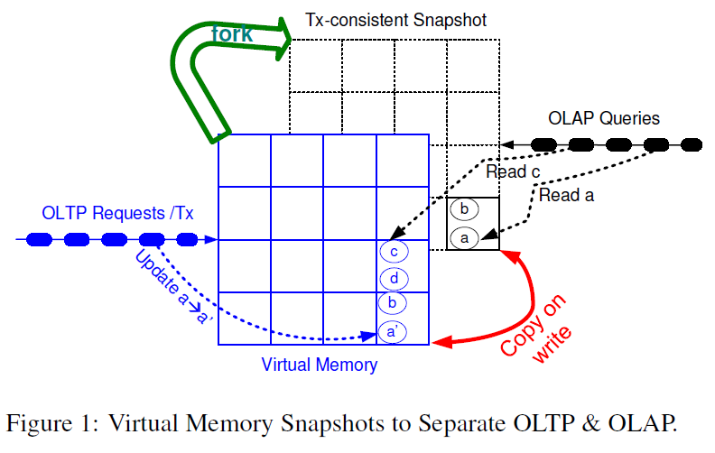
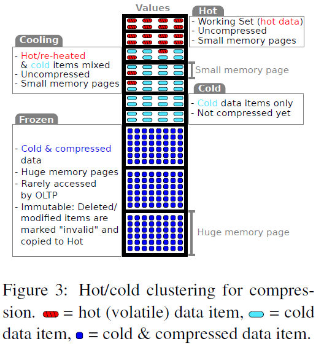

# HyPer: Adapting Columnar Main-Memory Data Management for Transactional AND Query Processing

____

## Intoduction

HyPer is a column-oriented hybrid OLTP and OLAP main memory database system. Unlike most of commercial databases, HyPer maintains one consistant database state to run both OLTP and OLAP queries in parallel in one system. In doing this, it overcomes the problems of data freshness and resource overconsumption inherent in systems which keep two copies of the same database to support the two different types of queries.

Major design points in HyPer are:
1. In-memory data management: gets rid of DBMS-controlled page structures and buffer management.

2. Snapshotting: hardware supported virtual memory management for creating consistant snapshots of data (more on this in the next section).

3. Query Evaluation: transactions and queries in SQL are compiled directly into LLVM assembly code. Transactions are stored as procedures. The query evaluation scheme tries to apply as many operations on a data object as possible in between pipeline breakers, achieving register-locality.*

4. Transation parallelism: to achieve transaction parallelism, the database is partitioned logically (e.g. according to key ranges) and multiple _partition restricted_ transactions are allowed to run simultaneously. Transations dealing with the same partition are serialized. No locking is needed this way.

5. Logging: logical logging is used (the invocation parameters of stored transactions are logged).*

6. Indexing: hash based indexes are used for exact match queries whereas tree based indexes (RB trees, radix trees) are used for range queries.

## Overview of Snapshotting techniques

HyPer leverages operating system support for virtual memory management to maintain consistant snapshots of transactional data. The OLTP process owns the database (i.e. has the control over database address space). OLAP processes are forked periodically, in orders of seconds or minutes, which obtain an exact copy (snapshot) of the OLTP parent process's address space. This new copy of data is managed by the OS and page sharing and shadow paging (copy-on-write) are supported _in hardware_ by the Memory Management Unit via page tables and copy-on-write mechanisms. Therefore, creating and maintaining a snapshot is extremely efficient especially since all the data is in main memory.

>Main memory databases solve the disk data-clustering problem that arises due to shadow paging - a new page has to be allocated whenever a page is written to, which might not be in contnuation with existing disk-pages.

Other software snapshotting techniques include tuple shadowing which generates new version of a tuple when it is modified and twin objects approach (also called zig zag approach) which marks the relevant versions of tuples with flags.*

Hardware supported snapshotting gives the highest throughput for both OLTP and OLAP queries because hardware techniques for reorganizing pages in memory are faster.

## Data Clustering and Compression

A big advatage of column-oriented databases is memory efficiency due to compression. However, updates on compressed data are costly, which is why OLTP databases often don't compress their data. Clustering data into hot and cold sets helps avoid this trade-off.

OLTP workloads generally access only a small subset of data and modify an even smaller subset. This _working set_ is mostly tuples that were added recently to the database. HyPer has a lightweight component that monitors accesses to the database and segregates the data into hot and cold clusters. 

Data in the hot cluster is stored uncompressed and is expected to be accessed and modified frequently. A small page size is used to store this data. Cold data can be compressed aggresively and stored in huge pages because only OLAP queries (which work well with compression) access this data. Large page size is beneficial for large scans over data because it reduces TLB misses. Also TLBs in most systems have different sections for different pages sizes, which means OLTP and OLAP don't compete for resources and TLB thrashing doesn't occur.

Using different page sizes to store hot and cold data is advantageous because it means a large portion of data is stored in huge pages, which leads to smaller page tables and faster snapshot creation (address space duplication requires duplicating page tables). And since the hot portion of data is stored in small pages, copy-on-write mechanism requires less overhead. If a frozen tuple is updated, it is marked as invalid in the cold partition and re-inserted into the hot working set.

Hence, clustering data into hot and cold partitions allowes for compression and handles the page size tradeoff between OLTP and OLAP queries.

## Explore

* Data-centric query evaluation
* Logical logging
* Software snapshotting techniques