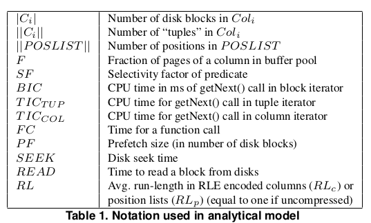
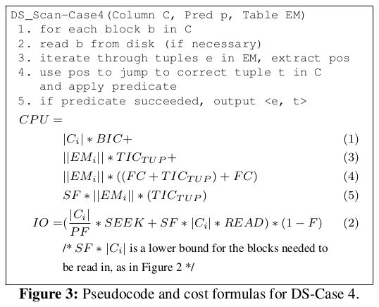
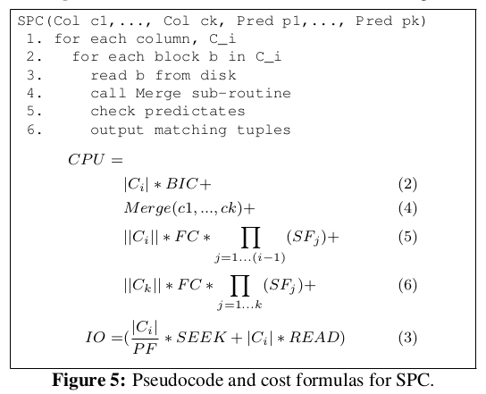
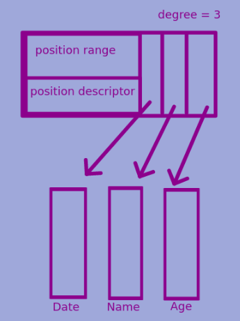
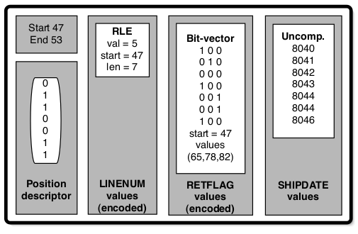
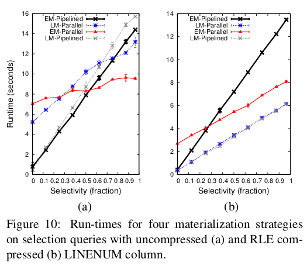
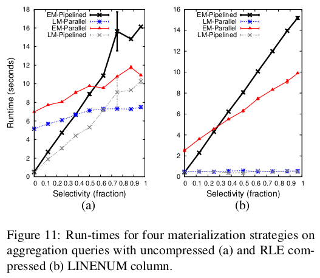
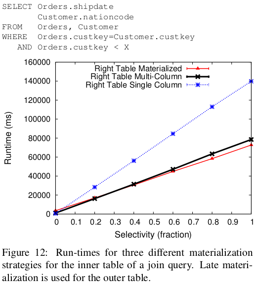

### Introduction
The paper introduces a model for calculating cost of queries. It also describes an in-memory data structure to cache intermediate results. It compares different query plans using this cost model namely:

1. parallel vs pipelined
2. late vs early materialization
3. joins with materialized, single column and multi-column approach

The paper asserts that early (EM) and late materialization (LM) have different trade-offs. It says that LM can operate on position data, filter only relevant tuples and have high iteration speed. However it often requires re-accessing a tuple multiple times in a query and this cost is high. EM type queries are favourable in queries where selectivity is high since only very few tuples are created initially and flow through the query plan.

### Operators

The paper performs all its experiments on the C-store db. It describes 3 fundamental types of operators that can be used to construct any query.

1. Data source (DS) operator which reads a column from disk filtering on or more predicates producing either pos list or (pos, val) list
2. AND operator which merges several position list into a final list in which only positions present in all lists are present
3. Tuple construction combines multiple narrow tuples into wider tuples. This operator has negligible cost and will not be covered.

### Data source operators

There are four DS operators. 1 and 3 are type LM while 2 and 4 are type EM.
1. Apply predicate to blocks of column and return pos list
2. Apply predicate to blocks of column and return (pos, val) list
3. Use a pos list to filter blocks of a column and return values.
4. Use a (pos, <val1, val2, .., valn>) list to find positions in blocks of a column and apply a predicate return (pos, <val1, val2, .., valn, valn+1>) list for values which satisfy condition.

NOTE: DS3, DS4 can skip reading entire blocks if it does not contain any positions relevant to the pos/(pos, val) list.

For brevity only the DS4 operator is analysed below. For other queries refer to the paper.

NOTE: Selectivity factor is defined as `number of tuples selected/number of tuples visited`. A highly selective predicate has a low selective factor.

### Tuple construction operators

There are two tuple construction operators.

1. MERGE operator which k-sets of values of produces a k-ary tuple. It assumes equal number of values in each set (probably truncation upto the smallest number, if not).

2. Scan, Predicate, Contruct (SPC) take a set of columns, reads them of the disk, applies a set of predicates to them and constructs tuples if all predicates pass.

### Multi-columns

Multi-columns is data structure to cache intermediate results. It improves the performance of operators by reducing disk IO and by storing results from previous queries.

A multi-column is a horizontal partition of a subset of attributes. It consists of the following:

1. `covering position range` indicating the virtual starting and ending position the horizontal partition.
2. array of `mini column`s where a `mini column` is the set of values for a given position range for an attribute/column.
3. the `degree` of a multi-column is the number of attributes included in the mini-column array.
4. a `position descriptor` (PD) indicating which positions remain valid.

PD can be stored in many forms as given below. Trade off is between the number valid tuples and amount and memory taken to represent positions.

An example of how multi-column works is explained with the help of operator DS1. When a page is read from disk, a `mini-column` is created which is just a pointer to the page in the buffer pool, with a position descriptor marking all pos as valid. The `mini-column` is stored in a `multi-column`. The DS1 operators iterates of the column applies predicate, gets a list of valid positions. The `multi-column` replaces its PD with this new one. Any further queries that access this column can directly use this result.

The other common operator that interacts with `multi-columns` is AND which joins two of them. It is described in detail in the paper.

### Joins

The effect of EM and LM is relevant to how join is implemented. It considers that left column of a join is usually iterated in order while the right column is randomly accessed. Only approaches 2, 3 and 4 have been benchmarked. There four approaches discussed:

1. If EM is used in a join then the tuples have already been constructed, together and the join operator behaves like a row store iterator.
2. With LM the join operator only gets the columns that are being compared. It outputs a pair of positions where the comparison succeeds. Jive join can be considered one implementation of this.
3. Hybrid approach where the right relation sends tuples while the left relation sends on the single join predicate column (pos list of the relevant column). The output is relevant tuples from right relation and ordered list of pos from left relation. The pos list can then be used to retrieve more columns from the left relation and complete tuple construction. It has the advantage of materializing only relevant values from the left and avoiding the penalty of materializing right relation values from unordered positions (since the right relation positions get scrambled).
4. The hybrid approach can benefit from the `multi-column` structure. All relevant columns and predicate columns are input to join operator (in the form of a `multi-column`). As the inner table values match the join predicate, the position is used to retrieve and stitch together other columns. However this is good for low selectivity since few tuples need to be constructed. Otherwise the cost of reaccessing a column, once to compare and then to create tuple is high.

### Benchmarking performance

The authors came up with a set of values for the terms they had used to create the cost model. This was done by micro-benchmarking. After this they ran the various query plans and compared the results with their theoretical estimates. The models closely resembled theoretical estimates.

### Conclusion

This paper gives a framework to evaluate query performance.  IT says that the optimal at which to perform tuple construction in a column database is not obvious. However it establishes a good heuristic.

1. Use LM if the data is aggregated, has low selectivity or lightly compressed. Use EM otherwise
2. The right input table to a join should be materialized before (or during if a `multi-column` is used) the join operation.
