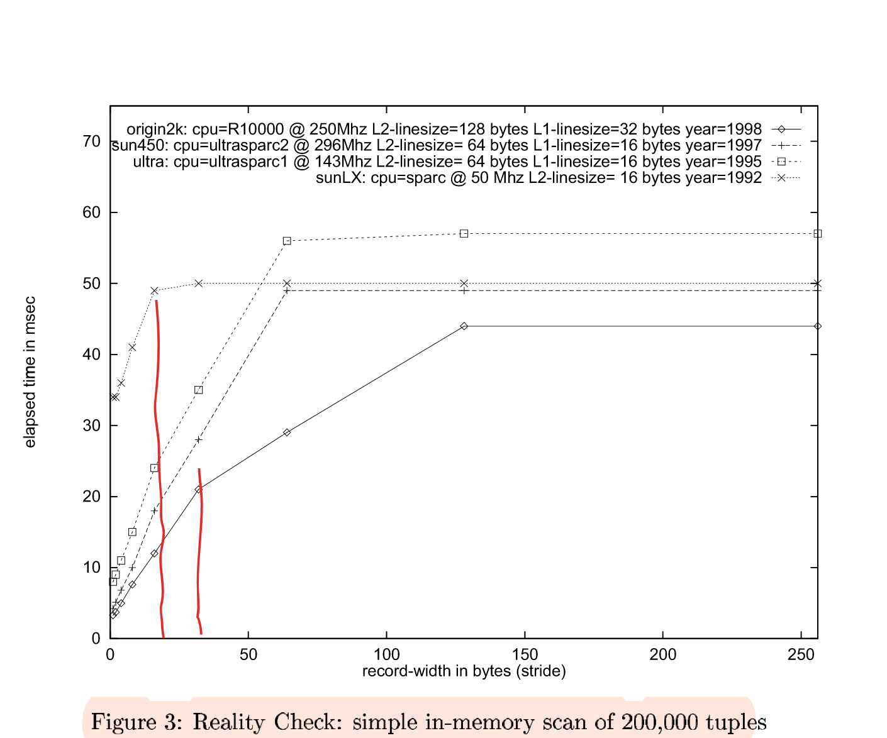

# Database Architecture Optimized for the new Bottleneck: Memory Access

[Complete Paper](http://www.vldb.org/conf/1999/P5.pdf)

## Introduction
This paper highlights the significance of memory access as a bottleneck, and makes recommendations on how to deal with this bottleneck.

## Experimental Setup
* The database used is MonetDB
* An in-memory buffer is sequentially scanned by reading one byte with a varying stride (the offset between consequently read memory locations). This mimics a read only scan of a column of one byte width.
* It was ensured that the buffer was in memory but not in cache.

## Math Setup
* The time cost can be defined as the sum of costs of pure computation, accessing the L2 cache, and accessing the main memory:

`T = T(CPU) + T(L2) + T(MEM)`
* The computation cost includes the cost of accessing data from the on-chip L1 cache.
* The cost `T(L2)` can be expressed as the product of the number of L1 cache misses and the L2 cache latency (tl2):

`T(L2) = M1(s) * tl2`
* Similarly, T(MEM) can be expressed as the product of the number of L2 cache misses and the main-memory latency (tmm):

`T(MEM) = M2(s) * tmm`
* Notice that the number of cache misses is defined as a function of _stride 's'_. A more complete version of the function is:

`Mx(s) = min(s/LSx, 1)`
where _'x'_ denotes the cache level, _'s'_ denotes the stride, and _'LSx'_ is the line size of the cache at level _'x'_
* The cache is organized in lines of fixed size, and these constitute the address space of the cache. A line contains the spatially local data that is brought in from memory (prefetching). When we describe a cache miss, we mean the value was not found at the address or the cache line where it was expected. 
* When the stride is less than the line size, multiple values (`LS/s` to be precise) can be read without a miss. As the stride increases, the miss rate increases, until it reaches a maximum of 1. This occurs when the stride becomes equal to the line size. For all values of stride beyond this value, every memory read results in a cache miss. Hence we have the `min` function.

## Observations

We can see the slope changing when the stride exceeds the line size of the cache at each level.

## Architectural implications
* The stride of memory access is a crucial factor that determines memory latencies
* Virtual IDs are used as row identifiers. This coupled with compression techniques such as byte encoding can bring down stride signifcantly
* Joins are the most problematic database operation due to a large number of random accesses required. The paper proposes a join algorithm called the _radix-join_. 

### Radix-join
* Typically, clustered hash joins are used. The inner relation is hashed, the outer relation is then scanned and matches are found. In order to make the data structures fit into memory, they are clustered into _H_ smaller sets. This constitutes a random access pattern where data has to be written to _H_ different locations. If _H_ exceeds the number of cache lines available or the TLB size, performance is severely degraded. Therefore the clustering algorithm needs to have a cache-friendly memory access pattern. 
* The radix join algorithm iteratively clusters based on _b_ bits at a time. In each iteration, `2^b` clusters are created and subsequent iterations cluster within the same small cluster. 
* Ultimately, a nested for loop is used within the smaller _H_ clusters (Shatdahl et. al, 1994, are cited).